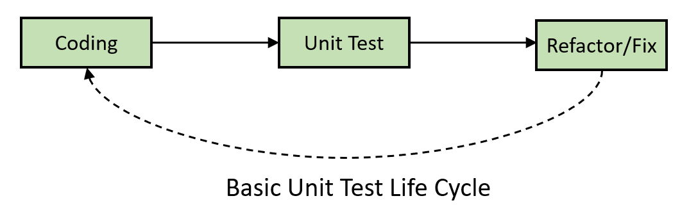
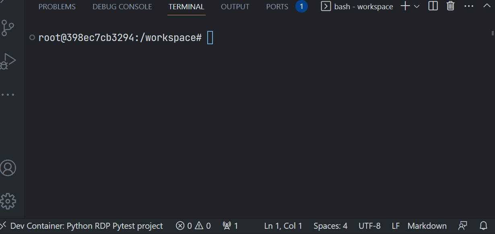
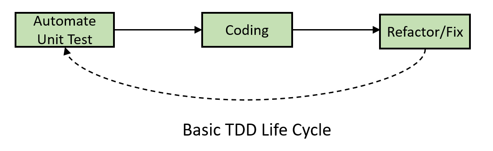

# Getting Start Unit Test with Pytest for an HTTP REST Python Application
- version: 2.0
- Last update: January 2025
- Environment: Windows
- Prerequisite: [Access to RDP credentials](#prerequisite)

Example Code Disclaimer:
ALL EXAMPLE CODE IS PROVIDED ON AN “AS IS” AND “AS AVAILABLE” BASIS FOR ILLUSTRATIVE PURPOSES ONLY. LSEG MAKES NO REPRESENTATIONS OR WARRANTIES OF ANY KIND, EXPRESS OR IMPLIED, AS TO THE OPERATION OF THE EXAMPLE CODE, OR THE INFORMATION, CONTENT, OR MATERIALS USED IN CONNECTION WITH THE EXAMPLE CODE. YOU EXPRESSLY AGREE THAT YOUR USE OF THE EXAMPLE CODE IS AT YOUR SOLE RISK.

## <a id="intro"></a>Introduction

Today, applications are bigger and more complex. A few changes to the source code to add more features or fix bugs can make unexpected behavior in an application. Developers cannot just wait for the test result from the QA team anymore. They need to do unit testing regularly as an integral part of the development process. 

Unit testing is a software testing method that helps developers verify if any changes break the code. Unit testing significantly improves code quality, saves time to find software bugs in an early stage of the development lifecycle, and improves deployment velocity. Unit testing is currently the main process of a modern Agile software development practice such as CI/CD (Continuous Integration/Continuous Delivery), TDD (Test-driven development), etc.

Modern applications also need to connect to other services like APIs, databases, data storage, etc. The unit testing needs to cover those modules too. This example project shows how to run unit test cases for a [Python](https://www.python.org/) application that performs HTTP REST operations which is the most basic task of today's application functionality. With unit testing, developers can verify if their code can connect and consume content via HTTP REST API in any code updates. 

The example project is a part two of the [Getting Start Unit Test for an HTTP REST Application with Python](https://github.com/LSEG-API-Samples/Article.RDP.Python.HTTP.UnitTest) project. The first project uses the Python built-in [unittest](https://docs.python.org/3.9/library/unittest.html) as a test framework. This project uses more popular [pytest](https://docs.pytest.org/en/7.2.x/) as a test framework. The target application source code for testing remain the same, it uses a de-facto [Requests](https://requests.readthedocs.io/en/latest/) library to connect to the [Delivery Platform (RDP) APIs](https://developers.lseg.com/en/api-catalog/refinitiv-data-platform/refinitiv-data-platform-apis) as the example HTTP REST APIs.

**Note**:
This demo project is not cover all test cases for the HTTP operations and all RDP APIs services. It aims to give the readers an idea about how to unit test an application that makes an HTTP connection with Python only. 

## <a id="intro_unittest"></a>Unit Testing Overview

Let’s start with what unit test is. [Unit testing](https://en.wikipedia.org/wiki/Unit_testing) is the smallest test that focuses on checking that a single part of the application operates correctly. It breaks an application into the smallest, isolated, testable component called *units*, and then tests them individually. The unit is mostly a function or method call or procedure in the application source code. Developers and QA can test each unit by sending any data into that unit and see if it functions as intended. 

A unit test helps developers to isolate what is broken in their application easier and faster than testing an entire system as a whole. It is the first level of testing done during the development process before integration testing. It is mostly done by the developers automated or manually to verify their code.



You can find more detail about the unit test concept from the following resources:
- [Python Guide: Testing Your Code](https://docs.python-guide.org/writing/tests/) article.
- [How and when to use Unit Testing properly](https://softwareengineering.stackexchange.com/questions/89064/how-and-when-to-use-unit-testing-properly) post.

## <a id="intro_pytest"></a>Introduction to Pytest framework

The [pytest](https://docs.pytest.org/en/7.2.x/) (or sometime called py.test) is one of the most popular all-purpose Python testing frameworks. This open-source framework lets developers/QAs write small, readable, and scalable test cases that are suitable for both simple function testing and complex applications. Comparing to the bulky class-based unit test framework like Python's built-in [unittest](https://docs.python.org/3.9/library/unittest.html), the pytest framework has an easier learning curve with more flexibility.

Pytest Key Features:
- Use the Python standard [assert statement](https://docs.python.org/3.9/reference/simple_stmts.html#assert) for verifying expectations and values in Python tests, no more ```self.assertXXX``` methods like the unittest
- [Auto-discovery](https://docs.pytest.org/en/7.2.x/explanation/goodpractices.html#test-discovery) of test modules and functions
- [Modular fixtures](https://docs.pytest.org/en/7.2.x/reference/fixtures.html#fixture) for managing small or parametrized long-lived test resources
- You can run unittest cases with pytest too!
- Provide a lot of official and community plugins for extending the framework capability and integrations.

Example from [pytest official page](https://docs.pytest.org/en/7.1.x/getting-started.html#create-your-first-test):
``` Python
# test_sample.py
def func(x):
    return x + 1


def test_answer():
    assert func(3) == 5
```

To run the test, just run the following command:
``` bash
pytest .
```
Result:
``` bash
=========================== test session starts ============================
platform linux -- Python 3.x.y, pytest-7.x.y, pluggy-1.x.y
rootdir: /home/sweet/project
collected 1 item

test_sample.py F                                                     [100%]

================================= FAILURES =================================
_______________________________ test_answer ________________________________

    def test_answer():
>       assert func(3) == 5
E       assert 4 == 5
E        +  where 4 = func(3)

test_sample.py:6: AssertionError
========================= short test summary info ==========================
FAILED test_sample.py::test_answer - assert 4 == 5
============================ 1 failed in 0.12s =============================
```

Please find more detail about the pytest framework from the following resources:
- [pytest official page](https://docs.pytest.org/en/7.2.x/)
- [pytest getting started page](https://docs.pytest.org/en/7.2.x/getting-started.html)
- [Using pytest - Real Python](https://realpython.com/lessons/using-pytest/)

Let’s leave the pytest framework overview there.

## <a id="whatis_rdp"></a>What is Delivery Data Platform (RDP) APIs?

Now let me turn to our example HTTP API for this project. The [Data Platform (RDP) APIs](https://developers.lseg.com/en/api-catalog/refinitiv-data-platform/refinitiv-data-platform-apis) (formerly known as Refinitiv Data Platform) provide various LSEG data and content for developers via easy-to-use Web-based API.

RDP APIs give developers seamless and holistic access to all of the LSEG content such as Environmental Social and Governance (ESG), News, Research, etc, and commingled with their content, enriching, integrating, and distributing the data through a single interface, delivered wherever they need it.  The RDP APIs delivery mechanisms are the following:
* Request - Response: RESTful web service (HTTP GET, POST, PUT or DELETE) 
* Alert: delivery is a mechanism to receive asynchronous updates (alerts) to a subscription. 
* Bulks:  deliver substantial payloads, like the end-of-day pricing data for the whole venue. 
* Streaming: deliver real-time delivery of messages.

This example project is focusing on the Request-Response: RESTful web service delivery method only.  


For more detail regarding the RDP APIs, please see the following APIs resources: 
- [Quick Start](https://developers.lseg.com/en/api-catalog/refinitiv-data-platform/refinitiv-data-platform-apis/quick-start) page.
- [Tutorials](https://developers.lseg.com/en/api-catalog/refinitiv-data-platform/refinitiv-data-platform-apis/tutorials) page.

## <a id="testsuite_detail"></a>Test Suit Development Detail

Please see the full details over the test suite implementation on the [pytest-article.md](pytest-article.md) file.

## <a id="prerequisite"></a>Prerequisite

This demo project requires the following dependencies.

1. RDP Access credentials.
2. [Python](https://www.python.org/) 3.10 and above
3. Internet connection.

Please contact your LSEG representative to help you to access the RDP account and services. You can find more detail regarding the RDP access credentials set up from the lease see the *Getting Started for User ID* section of the [Getting Start with Data Platform](https://developers.lseg.com/en/article-catalog/article/getting-start-with-refinitiv-data-platform) article.

## <a id="how_to_run"></a>How to run the example test suite

The first step is to unzip or download the example project folder into a directory of your choice, then set up Python or Docker environments based on your preference.

### <a id="python_example_run"></a>Run example test suite in a console

1. Open a Command Prompt and go to the project's folder.
2. RRun the following command in the Command Prompt application to create a Python Virtual environment named *rdp_pytest* for the project.
    ``` bash
    $>python -m venv rdp_pytest
    ```
3. Once the environment is created, activate a virtual environment *rdp_pytest* environment with this command.
    ``` bash
    $>rdp_pytest\Scripts\activate
    ```
4. Run the following command to the test dependencies (```requirements_test.txt```) in the *rdp_pytest* environment 
    ``` bash
    (rdp_pytest) $>pip install -r requirements_test.txt
    ```
5. Once the dependencies installation process is success, Go to the project's *tests* folder, then run the following command to run the ```test_rdp_http_controller.py``` test suite.
    ``` bash
    (rdp_pytest) $>tests\pytest test_rdp_http_controller.py
    ```
    You can pass pytest arguments too. The following example runs only test cases for the RDP ESG service in verbose mode.

    ``` bash
   (rdp_pytest) $>tests\pytest -m test_esg -v
    ```
6. To run all test suites (```test_rdp_http_controller.py``` and ```test_app.py``` files), run the following command in the project's *tests* folder.
    ``` bash
    (rdp_pytest) $>tests\pytest .
    ```
### <a id="docker_example_run"></a>Run example test suite in Docker

1. Start Docker
2. Open a console, then go to the *project root* and run the following command to build a Docker image.
    ``` bash
    $> docker build . -t python_pytest
    ```
3. Run a Docker container with the following command: 
    ``` bash
    $> docker run -it --name python_pytest python_pytest
    ```
    You can pass pytest arguments too. The following example runs only test cases for the RDP Login API in a verbose mode.

    ``` bash
    $> docker run -it --name python_pytest python_pytest -m test_login -v
    ```
4. To stop and delete a Docker container, press ``` Ctrl+C``` (or run ```docker stop python_pytest```) then run the following command:
    ``` bash
    $> docker rm python_pytest
    ```
5. To delete a Docker image, run the ```docker rmi python_pytest``` after a container is removed.

### Running as VS Code DevContainer

1. Start a Docker desktop or Docker engine on your machine.
2. Install the [VS Code - Remote Development extension pack](https://aka.ms/vscode-remote/download/extension).
3. Open the VS Code Command Palette with the ```F1``` key, and then select the **Remote-Containers: Reopen in Container** command.
4. Once this build is completed, VS Code automatically connects to the container, and automatics initializes the project for developers.  Now VS Code is ready for running and testing the Project inside this devcontainer.

Example Result:
``` Bash
(rdp_pytest) C:\rdp_python_pytest\test>pytest .
=============================================== test session starts ===============================================
platform win32 -- Python 3.9.15, pytest-7.2.1, pluggy-1.0.0
rootdir: C:\rdp_python_pytest\test    
plugins: requests-mock-1.10.0
collected 15 items

test_app.py ...                                                                                               [ 20%]
test_rdp_http_controller.py ............                                                                      [100%]

================================================ 15 passed in 0.17s =================================================
```



Alternatively, you can use [VS Code Python testing tool](https://code.visualstudio.com/docs/python/testing#_configure-tests) to run test cases too. The ```.vscode``` project setting is included with the project.

That covers how to run an example test suite.

## <a id="summary"></a>Conclusion and Next Steps

That brings me to the end of this pytest project example. Unit testing is now the mandatory process of a software development lifecycle for both modern and legacy applications. It helps to expose unintentional behaviors of a tiny part of the application quicker than trying to find bugs in a big complex phase. It speeds up the overall feedback loop and improves trust among the project team. Unit testing also helps improves application source code quality, developers have more confidence in refactoring the source code for better performance and cleaner code. As the author of this article, I also have learned a lot from this project. There are a lot of error handlers or code logic that I never think of until I started to write unit test cases. 

This example project demonstrates the manual unit testing method. However, developers should run unit test cases automatically every time they made changes to the code (or configurations). The most practical technique is running automated unit tests as part of the developers' Continuous Integration/Continuous Delivery (CI/CD) pipeline. Developers can apply the TDD (Test-driven development) approach that writing and correcting the failed tests before writing new code with their project too.



The [pytest](https://docs.pytest.org/en/7.2.x/) test framework and [requests-mock](https://pypi.org/project/requests-mock/) mocking library are other good choices to learn a unit testing with [Python](https://www.python.org/) and HTTP REST application. They are easy to learn, provide powerful but simple to use features for developers, and also supports a lot of plugins and Python development frameworks.

At the same time, the [RDP APIs](https://developers.lseg.com/en/api-catalog/refinitiv-data-platform/refinitiv-data-platform-apis) provide various LSEG data and content for developers via an easy-to-use Web-based API. The APIs are easy to integrate into any application and platform that supports the HTTP protocol and JSON message format. 

That’s all I have to say about unit testing with pytest.

## <a id="references"></a>References

That brings me to the end of my unit test example project. For further details, please check out the following resources:

- [RDP APIs page](https://developers.lseg.com/en/api-catalog/refinitiv-data-platform/refinitiv-data-platform-apis) on the [LSEG Developer Community](https://developers.lseg.com/) website.
- [RDP APIs Playground page](https://apidocs.refinitiv.com/Apps/ApiDocs).
- [RDP APIs: Introduction to the Request-Response API](https://developers.lseg.com/en/api-catalog/refinitiv-data-platform/refinitiv-data-platform-apis/tutorials#introduction-to-the-request-response-api).
- [RDP APIs: Authorization - All about tokens](https://developers.lseg.com/en/api-catalog/refinitiv-data-platform/refinitiv-data-platform-apis/tutorials#authorization-all-about-tokens).
- [Limitations and Guidelines for the RDP Authentication Service](https://developers.lseg.com/en/article-catalog/article/limitations-and-guidelines-for-the-rdp-authentication-service) article.
- [Getting Started with Data Platform](https://developers.lseg.com/en/article-catalog/article/getting-start-with-refinitiv-data-platform) article.
- [Python pytest framework official page](https://docs.pytest.org/en/7.2.x/).
- [Python requests-mock library page](https://requests-mock.readthedocs.io/en/latest/).
- [pytest-datadir library](https://pypi.org/project/pytest-datadir/) page.
- [Python Guide: Testing Your Code](https://docs.python-guide.org/writing/tests/) article.
- [Using pytest - Real Python](https://realpython.com/lessons/using-pytest/) website.
- [How and when to use Unit Testing properly](https://softwareengineering.stackexchange.com/questions/89064/how-and-when-to-use-unit-testing-properly) post.
- [13 Tips for Writing Useful Unit Tests](https://betterprogramming.pub/13-tips-for-writing-useful-unit-tests-ca20706b5368) blog post.
- [pytest document: How to mark test functions with attributes](https://docs.pytest.org/en/7.1.x/how-to/mark.html#how-to-mark-test-functions-with-attributes)
- [pytest document: Working with custom markers](https://docs.pytest.org/en/7.1.x/example/markers.html#working-with-custom-markers)

For any questions related to the RDP APIs, please use the [Developers Community Q&A page](https://community.developers.refinitiv.com/).
